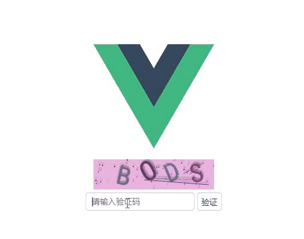

# vue-validate

##### 写在前面

```
有的项目表单提交前需要验证非机器人操作
（ps:这个活我个人觉得应该是前后端搭配，但是不乏有的技术老大要求纯前端完成）。
这里就是纯前端完成。后续我会兼容纯前端与前后端搭配两种方案。
```

##### demo

[点击访问demo](https://oops20180325.github.io/vue-validate/)



```vue
<template>
  <div class="hello" >
    <yanzheng v-on:validate='result'  size='4' width='200' />
  </div>
</template>

<script>
import yanzheng from './验证'
export default {
  name: 'HelloWorld',
  data () {
    return {
    }
  },
  components:{
    yanzheng
  },
  methods:{
    result(data){
      alert('验证结果为：'+data)
    }
  }
}
</script>


```
## Build Setup

``` bash
# install dependencies
npm install

# serve with hot reload at localhost:8080
npm run dev

# build for production with minification
npm run build

# build for production and view the bundle analyzer report
npm run build --report
```

##### 结束语

```
暂时就写这么多吧后面我逐渐完善。希望大家用得舒心。
```
